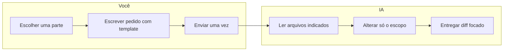

# Guia para refinar cada parte do BPM com IA com mínimo de créditos

## Princípio central

**Uma conversa = uma parte/um escopo.** Cada refinamento deve tratar de **um bloco lógico** (uma área, uma tela, um fluxo ou um tipo de problema). Assim a IA altera só o combinado e não explora o projeto inteiro.

---

## Como solicitar cada refinamento (template)

Use este formato ao pedir mudanças:

1. **Onde:** rota ou arquivo(s) principal(is).
2. **O que:** comportamento ou UI atual (em 1–2 frases).
3. **O que você quer:** resultado desejado (comportamento ou visual).
4. **Restrição (opcional):** "não alterar X" ou "manter compatível com Y".

**Exemplo:**

> "Na **tela de login** (`src/app/login/page.tsx`): hoje o formulário só mostra erro genérico. Quero **mensagens específicas** por tipo (senha errada, email não encontrado, conta pendente) e um link para redefinir senha. **Não mudar** o fluxo de redirect após login."

Com isso a IA sabe onde atuar, o que existe, o que você quer e o que não mexer — reduz buscas e alterações desnecessárias.

---

## Partes que você pode refinar (referência)

Use esta lista para **escolher uma parte por vez** e dar o contexto certo:

| Parte | Onde está | Exemplo de pedido focado |
|-------|-----------|---------------------------|
| **Auth** | `login/`, `primeiro-acesso/`, `conta-pendente/`, `middleware.ts`, `lib/auth.ts` | "Refinar apenas a página de primeiro acesso: copy e validação do formulário." |
| **Escritório – Dashboard** | `escritorio/dashboard/`, `components/dashboard/` | "Ajustar só os cards de métricas do dashboard do escritório: layout e dados exibidos." |
| **Escritório – Demandas** | `escritorio/demandas/`, fases do ciclo | "Refinar só a fase de Levantamento da demanda: campos e fluxo de salvar." |
| **Escritório – Estratégia** | `escritorio/estrategia/` (SWOT, cadeia, portfolio, framework) | "Melhorar apenas a tela de SWOT: UX e salvamento." |
| **Escritório – Usuários/Perfis** | `escritorio/usuarios/`, `usuarios/perfis/`, `usuarios/novo/` | "Refinar a listagem de usuários: filtros e ações em lote." |
| **Escritório – Outros** | conhecimento, capacitação, manual, suporte, configurações, branding, backup | "Refinar só a página X: [comportamento ou layout desejado]." |
| **Admin** | `admin/`, subpastas (escritórios, planos, serviços, etc.) | "Refinar apenas o CRUD de planos no admin: formulário e validações." |
| **IA** | `api/ai/`, `lib/ai/`, `components/ai/`, `hooks/use-ai.ts` | "Ajustar só o painel de histórico de versões da IA: exibição e paginação." |
| **Layout/Shell** | `components/layout/`, `app/escritorio/layout.tsx`, `app/admin/layout.tsx` | "Refinar só o sidebar do escritório: itens, agrupamento e estados ativos." |
| **Supabase/RLS** | `supabase/migrations/`, `supabase/scripts/` | "Ajustar apenas as políticas RLS da tabela X para [regra desejada]." |

---

## O que fazer para gastar menos créditos

- **Cite o arquivo ou a rota** no primeiro mensagem (ex.: "em `src/app/escritorio/dashboard/page.tsx`"). Assim a IA vai direto ao ponto.
- **Evite pedidos vagos** como "melhorar o dashboard" ou "deixar mais bonito". Especifique: "melhorar o dashboard" → "reorganizar os cards em grid responsivo e alinhar métricas com os dados do Supabase".
- **Um tema por conversa:** não misture "refinar login + demandas + admin" na mesma thread. Abra uma conversa por parte.
- **Se for grande, quebre:** em vez de "refinar todo o ciclo de demandas", use "refinar só a fase de planejamento" e em outra conversa "refinar a fase de análise".
- **Diga o que não mudar** quando for importante (ex.: "manter a API de IA como está", "não alterar RLS de outras tabelas").

---

## Fluxo sugerido

1. Você escolhe **uma** parte da tabela acima.
2. Redige o pedido com **Onde + O que + O que você quer + Restrições**.
3. Envia **uma mensagem** com isso.
4. A IA tende a ler menos arquivos e alterar só o combinado, reduzindo créditos e risco de mudanças fora do escopo.

---

## Resumo

- **Uma parte por vez**, com **arquivo/rota** e **comportamento desejado** claros.
- Use o **template** (Onde / O que / O que você quer / Restrições) em cada pedido.
- Para refinar "cada uma das partes", repita o processo **por área** (auth, dashboard, demandas, estratégia, admin, IA, etc.), sempre com escopo bem definido.

Assim você consegue refinar cada parte da ferramenta com resultado excelente e uso mínimo de créditos de IA.
